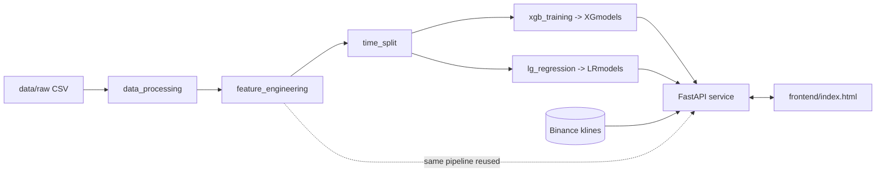
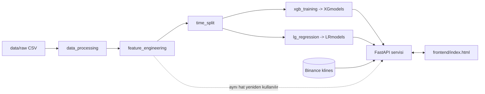

# BTC Prediction

<p align="center">
  <strong>🌐 Language / Dil:</strong>
  <a href="#-english">English</a> ·
  <a href="#-türkçe">Türkçe</a>
</p>


---

<a id="-english"></a>

# 🇬🇧 English

A machine-learning service that predicts the **direction of the next BTC/USDT candle** (`UP` / `DOWN` / `NEUTRAL`) across four timeframes (15m, 1h, 4h, 1d). It ships an end-to-end pipeline — data processing, feature engineering, chronological splitting and model training (XGBoost + Logistic Regression) — together with a FastAPI inference service and a minimal browser dashboard that fetches live data from Binance and returns a prediction with confidence scores.

> ⚠️ **Disclaimer:** This is an educational / research project. It is **not** financial advice and must not be used to make real trading decisions.

## 📑 Table of Contents

- [Features](#features-en)
- [Tech Stack](#tech-stack-en)
- [Architecture](#architecture-en)
- [Prerequisites](#prerequisites-en)
- [Installation](#installation-en)
- [Environment Variables & Configuration](#env-en)
- [Running the Project](#running-en)
- [Project Structure](#structure-en)
- [API Documentation](#api-en)
- [Tests](#tests-en)
- [Contributing](#contributing-en)
- [License](#license-en)

<a id="features-en"></a>
## ✨ Features

- **Two model families** served side by side:
  - **XGBoost** — *Binary Relevance* design: separate `UP` and `DOWN` detectors with per-model decision thresholds, combined via a confidence-gap conflict resolver.
  - **Logistic Regression** — a single 3-class (`-1 / 0 / +1`) classifier with `StandardScaler`.
- **Four timeframes** trained independently: `15m`, `1h`, `4h`, `1d`, each with its own feature windows and target threshold.
- **40-feature engineering pipeline**: log-returns, rolling/realized volatility, ATR, RSI, MACD, Bollinger position, moving-average deviations, volume z-scores, taker-buy / order-flow ratios, OBV change, candle-shape ratios, lagged returns and cyclical time features.
- **Leakage-safe chronological split** (70 / 15 / 15) with purge rows at the train/val/test boundaries — no random shuffling on time-series data.
- **Class-imbalance handling** via per-sample weights and (for XGBoost) `scale_pos_weight`.
- **Hyperparameter optimization** with Optuna (Bayesian TPE), maximizing macro-F1 on the validation set, with an optional `--skip-tuning` fast path.
- **Live inference API** (FastAPI) that pulls fresh OHLCV directly from the public Binance REST endpoint, re-applies the exact training feature pipeline, and returns prediction + calibrated confidences.
- **Models loaded once into RAM** at startup via a singleton registry; `/health` reports how many are loaded.
- **Auto-generated, interactive API docs** (Swagger UI + ReDoc).
- **Zero-build frontend dashboard** — a single static `index.html` with model/timeframe selectors and an animated confidence bar.

<a id="tech-stack-en"></a>
## 🧰 Tech Stack

| Layer | Technology | Version (from `requirements.txt`) |
|-------|-----------|-----------------------------------|
| Language | Python | 3.10+ (see note below) |
| ML — Gradient Boosting | XGBoost | `>=2.0.0` |
| ML — Linear | scikit-learn (LogisticRegression, StandardScaler) | `>=1.4.0` |
| Hyperparameter tuning | Optuna | `>=3.6.0` |
| Data | pandas | `2.2.2` |
| Numerics | numpy | `1.26.4` |
| Technical indicators | computed manually in `feature_engineering.py` | — |
| Plotting | matplotlib / seaborn | `>=3.8.0` / `>=0.13.0` |
| API framework | FastAPI | `>=0.110.0` |
| ASGI server | Uvicorn (`[standard]`) | `>=0.29.0` |
| Exchange data | httpx (Binance REST) | `>=0.27.0` |
| Model persistence | joblib (LR) / XGBoost native JSON | — |
| Frontend | Vanilla HTML + CSS + JavaScript (`fetch`) | — |

> **Note on indicators & exchange access:** Technical indicators are computed manually in `feature_engineering.py`, and candles are fetched directly through `httpx` against the Binance `/api/v3/klines` endpoint (`binance_client.py`) — no third-party indicator or exchange-wrapper library is required.

<a id="architecture-en"></a>
## 🏗️ Architecture

The project has two clearly separated stages: an **offline training pipeline** (run on your machine) and an **online inference service** (FastAPI + frontend).

```
                          OFFLINE  (training, run via src/main.py)
 ┌─────────────┐   ┌──────────────────────┐   ┌──────────────┐   ┌────────────────────────┐
 │ data/raw/   │ → │ 1. data_processing   │ → │ 2. feature_  │ → │ 3. time_split          │
 │ CSV (2018-  │   │    (target labels,   │   │   engineering│   │   (70/15/15 chrono     │
 │ 2025)       │   │     cleaning)        │   │   (40 feats) │   │    + purge)            │
 └─────────────┘   └──────────────────────┘   └──────────────┘   └───────────┬────────────┘
                                                                              │
                                            ┌─────────────────────────────────┴───────────┐
                                            │ 4. training                                  │
                                            │   xgb_training/core.py  → data/XGmodels/{tf} │
                                            │   lg_regression/core.py → data/LRmodels/{tf} │
                                            └─────────────────────────────────┬────────────┘
                                                                              │ artifacts
 ─────────────────────────────────────────────────────────────────────────── │ ────────────
                          ONLINE  (run via run_api.py)                         ▼
 ┌──────────────┐   GET /api/v1/predict   ┌─────────────────────────────────────────────┐
 │ frontend/    │ ──────────────────────► │ FastAPI (src/api)                            │
 │ index.html   │ ◄────────────────────── │  • model_loader  → ModelRegistry (RAM cache) │
 └──────────────┘   prediction + conf.    │  • binance_client → live OHLCV via httpx     │
                                          │  • predictor      → features + inference     │
                                          └────────────────────┬────────────────────────┘
                                                               │ public REST
                                                               ▼
                                                    Binance /api/v3/klines
```

<details>
<summary>Mermaid version</summary>


</details>

<a id="prerequisites-en"></a>
## ✅ Prerequisites

- **Python 3.10+** — see the version note below.
- **pip** (and ideally a virtual environment: `venv` / `conda`).
- **A CUDA-capable NVIDIA GPU** *(training only)* — the XGBoost training code uses `device='cuda'` and `tree_method='hist'`. If you only want to run the API for inference, a GPU is **not** required.
- **The `data/` directory**, which is **git-ignored** and shared separately (see [Configuration](#env-en)). For the API you need at least the trained model folders `data/XGmodels/{tf}` and/or `data/LRmodels/{tf}`. For retraining you also need the raw CSVs under `data/raw/`.
- **Internet access** to `https://api.binance.com` for live predictions.

> ⚠️ **Python version — please verify.** `requirements.txt` does not pin a Python version. Pinned deps (`numpy==1.26.4`, `pandas==2.2.2`) support roughly Python 3.10–3.12, while build artifacts in the repo were produced with **CPython 3.14**. Choose the interpreter that matches your environment; `<CONFIRM-PYTHON-VERSION>`.

<a id="installation-en"></a>
## ⚙️ Installation

```bash
# 1. Clone the repository
git clone https://github.com/ardilsungu/btc_prediction.git
cd btc_prediction

# 2. Create & activate a virtual environment
python -m venv .venv
# Windows (PowerShell):
.venv\Scripts\Activate.ps1
# macOS / Linux:
source .venv/bin/activate

# 3. Install dependencies
pip install -r requirements.txt

# 4. Obtain the data/ directory (models + raw data)
#    This folder is git-ignored and shared separately — see "Configuration".
#    Place it at the project root so paths resolve to:
#      data/XGmodels/{15m,1h,4h,1d}/...
#      data/LRmodels/{15m,1h,4h,1d}/...
```

<a id="env-en"></a>
## 🔧 Environment Variables & Configuration

This project **does not use a `.env` file or environment variables** — there is no `.env.example` in the repository, and all settings are defined directly in code. The table below documents where the meaningful configuration lives so you can adjust it.

| Setting | Where it's defined | Default | Purpose |
|---------|--------------------|---------|---------|
| API host | `run_api.py` (`--host`) | `0.0.0.0` | Network interface the server binds to |
| API port | `run_api.py` (`--port`) | `8000` | Server port |
| Hot reload | `run_api.py` (`--reload`) | off | Dev auto-reload |
| CORS origins | `src/api/main.py` | `["*"]` | Allowed frontend origins (restrict in production) |
| Trading symbol | `src/api/services/binance_client.py` (`SYMBOL`) | `BTCUSDT` | Pair fetched from Binance |
| Candles fetched | `binance_client.py` (`FETCH_LIMIT`) | 1500 / 500 / 300 / 200 | Warm-up history per timeframe |
| Model directories | `src/api/services/model_loader.py` | `data/XGmodels`, `data/LRmodels` | Where trained artifacts are loaded from |
| Target thresholds | `src/data_processing.py` (`TIMEFRAME_CONFIG`) | 0.15 / 0.30 / 0.60 / 1.50 (%) | Move size that defines UP/DOWN labels |
| Feature windows | `src/feature_engineering.py` (`TIMEFRAME_CONFIGS`) | per timeframe | Rolling/EMA/volume windows |
| Train/val/test split | `src/time_split.py` (`time_based_split`) | 0.70 / 0.15 / 0.15, purge 5 | Chronological split ratios |

> The **`data/` directory is the only external artifact you must obtain**; it is shared via Google Drive (per `.gitignore`).
> 📌 **Missing info:** Provide the actual share link → `<DATA-GOOGLE-DRIVE-LINK>`.

<a id="running-en"></a>
## ▶️ Running the Project

### A) Run the inference API (development)

```bash
# From the project root, with the venv active and data/ models present:
python run_api.py --reload
```

Then open:
- Swagger UI → http://localhost:8000/docs
- ReDoc → http://localhost:8000/redoc
- Health → http://localhost:8000/health

### B) Run the inference API (production-ish)

```bash
python run_api.py --host 0.0.0.0 --port 8000
# equivalently, directly via uvicorn:
uvicorn api.main:app --host 0.0.0.0 --port 8000 --app-dir src
```

### C) Open the frontend dashboard

The frontend is a single static file that talks to `http://localhost:8000`. With the API running, open `frontend/index.html` in a browser — for example via a simple static server:

```bash
# from the project root
python -m http.server 5500 --directory frontend
# then visit http://localhost:5500
```

> If you serve the frontend from a different origin, the API's CORS is already set to allow all origins (`["*"]`) — tighten this for production.

### D) Run the full training pipeline (requires `data/raw/` + CUDA GPU)

```bash
cd src

# Everything (processing → features → split → XGBoost + LR training):
python main.py

# A single timeframe:
python main.py --timeframe 1h

# Force re-computation of all intermediate files:
python main.py --force

# Skip Optuna tuning (fast baseline params):
python main.py --skip-tuning

# Control Optuna budget:
python main.py --trials 30

# Prepare data only, no training:
python main.py --skip-train
```

You can also run individual stages or a single model/timeframe:

```bash
cd src
python data_processing.py            # not a CLI entry; use main.py
python feature_engineering.py --force
python time_split.py --timeframe 1h
python -m xgb_training.train_1h --trials 50
python -m lg_regression.train_1h --skip-tuning
```

<a id="structure-en"></a>
## 🗂️ Project Structure

```
btc_prediction/
├── run_api.py                  # API entry point (uvicorn launcher)
├── requirements.txt            # Python dependencies
├── .gitignore                  # ignores data/, __pycache__, IDE files
│
├── frontend/
│   └── index.html              # Static dashboard (model/timeframe selectors + confidence UI)
│
├── src/
│   ├── main.py                 # Full training pipeline orchestrator (steps 1–4)
│   ├── data_processing.py      # Load/clean raw CSV + 3-class target creation
│   ├── feature_engineering.py  # 40-feature pipeline + per-timeframe configs
│   ├── time_split.py           # Chronological 70/15/15 split with purge
│   │
│   ├── xgb_training/
│   │   ├── core.py             # XGBoost: baseline, Optuna, Binary Relevance, eval, save
│   │   └── train_{15m,1h,4h,1d}.py   # Per-timeframe training entry points
│   │
│   ├── lg_regression/
│   │   ├── core.py             # Logistic Regression: scale, Optuna, eval, save
│   │   └── train_{15m,1h,4h,1d}.py   # Per-timeframe training entry points
│   │
│   └── api/
│       ├── main.py             # FastAPI app, lifespan (loads models), CORS, routers
│       ├── models.py           # Pydantic request/response schemas
│       ├── routers/
│       │   ├── health.py       # GET /health
│       │   └── predict.py      # GET /api/v1/predict
│       └── services/
│           ├── binance_client.py   # Live OHLCV via Binance REST (httpx)
│           ├── model_loader.py     # Singleton ModelRegistry (RAM cache)
│           └── predictor.py        # Feature prep + XGB/LR inference
│
└── data/                       # ⛔ git-ignored — obtain separately
    ├── raw/                    #   btc_{tf}_data_2018_to_2025.csv  (training input)
    ├── processing/             #   cleaned + labeled CSVs
    ├── feature_engineering/    #   {tf}_features.csv
    ├── splits/                 #   {tf}_{train,val,test}.csv
    ├── XGmodels/{tf}/          #   model_up.json, model_down.json, meta.json
    └── LRmodels/{tf}/          #   model.joblib, scaler.joblib, metrics.json
```

<a id="api-en"></a>
## 🔌 API Documentation

Base URL: `http://localhost:8000`

| Method | Endpoint | Query params | Description |
|--------|----------|--------------|-------------|
| `GET` | `/` | — | Service info / quick links (hidden from schema) |
| `GET` | `/health` | — | Service status + which models are loaded |
| `GET` | `/api/v1/predict` | `model`, `timeframe` | Generate a BTC direction prediction |
| `GET` | `/docs` | — | Swagger UI (interactive) |
| `GET` | `/redoc` | — | ReDoc documentation |

**`/api/v1/predict` parameters**

| Param | Type | Allowed values | Default | Description |
|-------|------|----------------|---------|-------------|
| `model` | string | `xgboost`, `lr` | `xgboost` | Which model family to use |
| `timeframe` | string | `15m`, `1h`, `4h`, `1d` | `1h` | Candle interval |

**Example request**

```bash
curl "http://localhost:8000/api/v1/predict?model=xgboost&timeframe=1h"
```

**Example response**

```json
{
  "symbol": "BTC/USDT",
  "timeframe": "1h",
  "model": "xgboost",
  "current_price": 64250.12,
  "prediction": "UP",
  "confidence": { "up": 0.61, "down": 0.18, "neutral": 0.21 },
  "threshold_used": { "up": 0.532, "down": 0.488 },
  "model_metrics": null,
  "candle_time": "2026-06-24T10:00:00Z",
  "requested_at": "2026-06-24T10:07:31.512Z"
}
```

**Status codes**

| Code | Meaning |
|------|---------|
| `200` | Prediction generated successfully |
| `422` | Invalid `model` / `timeframe` parameter |
| `503` | Requested model not loaded for that timeframe |
| `502` | Failed to fetch data from Binance |
| `500` | Prediction generation error |

<a id="tests-en"></a>
## 🧪 Tests

No automated test suite (`pytest`, etc.) is currently present in the repository. You can sanity-check the running service manually:

```bash
curl http://localhost:8000/health
curl "http://localhost:8000/api/v1/predict?model=lr&timeframe=4h"
```

> 📌 **Missing info:** if/when a test suite is added, document its command here (e.g. `pytest`).

<a id="contributing-en"></a>
## 🤝 Contributing

The Git history follows a **feature-branch → `develop` → `main`** workflow via pull requests. Existing branches map to pipeline stages: `processing`, `featuring`, `xgboost_training`, `logistic_regression`, `fast_api`, `develop`.

Suggested flow:

1. Branch from `develop` (e.g. `git checkout -b feature/my-change develop`).
2. Make focused commits.
3. Open a pull request into `develop`.
4. After review, `develop` is merged into `main`.

<a id="license-en"></a>
## 📄 License

Released under the **MIT License** — see the [`LICENSE`](LICENSE) file for the full text.

Copyright (c) 2026 Ardıl Sungu, Enes Taş.

---

## 📸 Screenshots


> 📌 **Add screenshots** — see the consolidated "What I need from you" list at the bottom.

---
---

<a id="-türkçe"></a>

# 🇹🇷 Türkçe

Dört zaman diliminde (15m, 1h, 4h, 1d) **bir sonraki BTC/USDT mumunun yönünü** (`UP` / `DOWN` / `NEUTRAL`) tahmin eden bir makine öğrenmesi servisidir. Uçtan uca bir hattı kapsar — veri işleme, özellik mühendisliği, kronolojik bölme ve model eğitimi (XGBoost + Lojistik Regresyon) — ayrıca Binance'ten canlı veri çekip güven skorlarıyla tahmin döndüren bir FastAPI servisi ve sade bir tarayıcı panosu içerir.

> ⚠️ **Sorumluluk reddi:** Bu, eğitim / araştırma amaçlı bir projedir. **Finansal tavsiye değildir** ve gerçek alım-satım kararları için kullanılmamalıdır.

## 📑 İçindekiler

- [Özellikler](#ozellikler-tr)
- [Teknoloji Yığını](#teknoloji-tr)
- [Mimari](#mimari-tr)
- [Gereksinimler](#gereksinimler-tr)
- [Kurulum](#kurulum-tr)
- [Ortam Değişkenleri ve Yapılandırma](#env-tr)
- [Projeyi Çalıştırma](#calistirma-tr)
- [Proje Yapısı](#yapi-tr)
- [API Dokümantasyonu](#api-tr)
- [Testler](#test-tr)
- [Katkıda Bulunma](#katki-tr)
- [Lisans](#lisans-tr)

<a id="ozellikler-tr"></a>
## ✨ Özellikler

- Yan yana sunulan **iki model ailesi**:
  - **XGBoost** — *Binary Relevance* tasarımı: ayrı `UP` ve `DOWN` dedektörleri, her modele özel karar eşikleri ve güven farkına dayalı çakışma çözümü.
  - **Lojistik Regresyon** — `StandardScaler` ile tek bir 3-sınıflı (`-1 / 0 / +1`) sınıflandırıcı.
- Bağımsız eğitilen **dört zaman dilimi**: `15m`, `1h`, `4h`, `1d`; her biri kendi özellik pencereleri ve hedef eşiğiyle.
- **40 özellikli mühendislik hattı**: log-getiriler, hareketli/gerçekleşmiş volatilite, ATR, RSI, MACD, Bollinger konumu, hareketli ortalama sapmaları, hacim z-skorları, taker-buy / order-flow oranları, OBV değişimi, mum şekli oranları, gecikmeli getiriler ve döngüsel zaman özellikleri.
- **Sızıntıya karşı güvenli kronolojik bölme** (70 / 15 / 15), train/val/test sınırlarında purge satırlarıyla — zaman serisinde rastgele karıştırma yapılmaz.
- Örnek başına ağırlıklar ve (XGBoost için) `scale_pos_weight` ile **sınıf dengesizliği yönetimi**.
- Doğrulama setinde macro-F1'i en üst düzeye çıkaran Optuna (Bayesçi TPE) ile **hiperparametre optimizasyonu**; isteğe bağlı `--skip-tuning` hızlı yolu.
- Doğrudan Binance REST uç noktasından güncel OHLCV çeken, eğitimdeki özellik hattının aynısını uygulayan ve tahmin + kalibre edilmiş güven değerleri döndüren **canlı tahmin API'si** (FastAPI).
- Başlangıçta tek bir singleton kayıt defteri üzerinden **modeller RAM'e bir kez yüklenir**; `/health` kaç tanesinin yüklü olduğunu bildirir.
- **Otomatik üretilen, etkileşimli API dokümanları** (Swagger UI + ReDoc).
- **Derleme gerektirmeyen pano** — model/zaman dilimi seçicileri ve animasyonlu güven çubuğu olan tek statik `index.html`.

<a id="teknoloji-tr"></a>
## 🧰 Teknoloji Yığını

| Katman | Teknoloji | Sürüm (`requirements.txt`'ten) |
|--------|-----------|-------------------------------|
| Dil | Python | 3.10+ (aşağıdaki nota bakın) |
| ML — Gradient Boosting | XGBoost | `>=2.0.0` |
| ML — Doğrusal | scikit-learn (LogisticRegression, StandardScaler) | `>=1.4.0` |
| Hiperparametre ayarı | Optuna | `>=3.6.0` |
| Veri | pandas | `2.2.2` |
| Sayısal işlemler | numpy | `1.26.4` |
| Teknik göstergeler | `feature_engineering.py` içinde elle hesaplanır | — |
| Grafik | matplotlib / seaborn | `>=3.8.0` / `>=0.13.0` |
| API çatısı | FastAPI | `>=0.110.0` |
| ASGI sunucusu | Uvicorn (`[standard]`) | `>=0.29.0` |
| Borsa verisi | httpx (Binance REST) | `>=0.27.0` |
| Model saklama | joblib (LR) / XGBoost yerel JSON | — |
| Önyüz | Saf HTML + CSS + JavaScript (`fetch`) | — |

> **Göstergeler ve borsa erişimi hakkında not:** Teknik göstergeler `feature_engineering.py` içinde elle hesaplanır ve mumlar doğrudan `httpx` ile Binance `/api/v3/klines` uç noktasından çekilir (`binance_client.py`) — üçüncü taraf bir gösterge veya borsa sarmalayıcı kütüphanesi gerekmez.

<a id="mimari-tr"></a>
## 🏗️ Mimari

Proje, net biçimde ayrılmış iki aşamadan oluşur: **çevrimdışı eğitim hattı** (kendi makinenizde çalışır) ve **çevrimiçi tahmin servisi** (FastAPI + önyüz).

```
                          ÇEVRİMDIŞI  (eğitim, src/main.py ile)
 ┌─────────────┐   ┌──────────────────────┐   ┌──────────────┐   ┌────────────────────────┐
 │ data/raw/   │ → │ 1. data_processing   │ → │ 2. feature_  │ → │ 3. time_split          │
 │ CSV (2018-  │   │    (hedef etiketleri, │   │   engineering│   │   (70/15/15 kronolojik │
 │ 2025)       │   │     temizleme)       │   │   (40 özellik)│  │    + purge)            │
 └─────────────┘   └──────────────────────┘   └──────────────┘   └───────────┬────────────┘
                                                                              │
                                            ┌─────────────────────────────────┴───────────┐
                                            │ 4. eğitim                                    │
                                            │   xgb_training/core.py  → data/XGmodels/{tf} │
                                            │   lg_regression/core.py → data/LRmodels/{tf} │
                                            └─────────────────────────────────┬────────────┘
                                                                              │ çıktılar
 ─────────────────────────────────────────────────────────────────────────── │ ────────────
                          ÇEVRİMİÇİ  (run_api.py ile)                          ▼
 ┌──────────────┐   GET /api/v1/predict   ┌─────────────────────────────────────────────┐
 │ frontend/    │ ──────────────────────► │ FastAPI (src/api)                            │
 │ index.html   │ ◄────────────────────── │  • model_loader  → ModelRegistry (RAM önbel.)│
 └──────────────┘   tahmin + güven        │  • binance_client → httpx ile canlı OHLCV    │
                                          │  • predictor      → özellik + çıkarım        │
                                          └────────────────────┬────────────────────────┘
                                                               │ herkese açık REST
                                                               ▼
                                                    Binance /api/v3/klines
```

<details>
<summary>Mermaid sürümü</summary>


</details>

<a id="gereksinimler-tr"></a>
## ✅ Gereksinimler

- **Python 3.10+** — aşağıdaki sürüm notuna bakın.
- **pip** (tercihen bir sanal ortam: `venv` / `conda`).
- **CUDA destekli bir NVIDIA GPU** *(yalnızca eğitim için)* — XGBoost eğitim kodu `device='cuda'` ve `tree_method='hist'` kullanır. Sadece API'yi çıkarım için çalıştıracaksanız GPU **gerekmez**.
- **`data/` dizini**, **git tarafından yok sayılır** ve ayrıca paylaşılır ([Yapılandırma](#env-tr) bölümüne bakın). API için en azından eğitilmiş model klasörleri `data/XGmodels/{tf}` ve/veya `data/LRmodels/{tf}` gerekir. Yeniden eğitim için ayrıca `data/raw/` altındaki ham CSV'ler gerekir.
- Canlı tahminler için `https://api.binance.com` adresine **internet erişimi**.

> ⚠️ **Python sürümü — lütfen doğrulayın.** `requirements.txt` bir Python sürümü sabitlemez. Sabitlenmiş bağımlılıklar (`numpy==1.26.4`, `pandas==2.2.2`) kabaca Python 3.10–3.12'yi destekler; depodaki derleme artefaktları ise **CPython 3.14** ile üretilmiştir. Ortamınıza uygun yorumlayıcıyı seçin; `<PYTHON-SÜRÜMÜNÜ-DOĞRULA>`.

<a id="kurulum-tr"></a>
## ⚙️ Kurulum

```bash
# 1. Depoyu klonlayın
git clone https://github.com/ardilsungu/btc_prediction.git
cd btc_prediction

# 2. Sanal ortam oluşturup etkinleştirin
python -m venv .venv
# Windows (PowerShell):
.venv\Scripts\Activate.ps1
# macOS / Linux:
source .venv/bin/activate

# 3. Bağımlılıkları kurun
pip install -r requirements.txt

# 4. data/ dizinini edinin (modeller + ham veri)
#    Bu klasör git tarafından yok sayılır ve ayrıca paylaşılır — "Yapılandırma" bölümüne bakın.
#    Yolların şu şekilde çözülmesi için proje köküne yerleştirin:
#      data/XGmodels/{15m,1h,4h,1d}/...
#      data/LRmodels/{15m,1h,4h,1d}/...
```

<a id="env-tr"></a>
## 🔧 Ortam Değişkenleri ve Yapılandırma

Bu proje **`.env` dosyası veya ortam değişkeni kullanmaz** — depoda `.env.example` yoktur ve tüm ayarlar doğrudan kod içinde tanımlıdır. Aşağıdaki tablo, ayarlayabilmeniz için anlamlı yapılandırmanın nerede bulunduğunu belgeler.

| Ayar | Tanımlandığı yer | Varsayılan | Amaç |
|------|------------------|------------|------|
| API host | `run_api.py` (`--host`) | `0.0.0.0` | Sunucunun bağlanacağı ağ arayüzü |
| API port | `run_api.py` (`--port`) | `8000` | Sunucu portu |
| Hot reload | `run_api.py` (`--reload`) | kapalı | Geliştirme otomatik yeniden yükleme |
| CORS kaynakları | `src/api/main.py` | `["*"]` | İzin verilen önyüz kaynakları (üretimde kısıtlayın) |
| İşlem sembolü | `src/api/services/binance_client.py` (`SYMBOL`) | `BTCUSDT` | Binance'ten çekilen parite |
| Çekilen mum sayısı | `binance_client.py` (`FETCH_LIMIT`) | 1500 / 500 / 300 / 200 | Zaman dilimi başına ısınma geçmişi |
| Model dizinleri | `src/api/services/model_loader.py` | `data/XGmodels`, `data/LRmodels` | Eğitilmiş çıktıların yüklendiği yer |
| Hedef eşikleri | `src/data_processing.py` (`TIMEFRAME_CONFIG`) | 0.15 / 0.30 / 0.60 / 1.50 (%) | UP/DOWN etiketini tanımlayan hareket büyüklüğü |
| Özellik pencereleri | `src/feature_engineering.py` (`TIMEFRAME_CONFIGS`) | zaman dilimine göre | Rolling/EMA/hacim pencereleri |
| Train/val/test bölme | `src/time_split.py` (`time_based_split`) | 0.70 / 0.15 / 0.15, purge 5 | Kronolojik bölme oranları |

> Edinmeniz gereken **tek dış çıktı `data/` dizinidir**; `.gitignore`'a göre Google Drive üzerinden paylaşılır.
> 📌 **Eksik bilgi:** Gerçek paylaşım bağlantısını sağlayın → `<DATA-GOOGLE-DRIVE-BAGLANTISI>`.

<a id="calistirma-tr"></a>
## ▶️ Projeyi Çalıştırma

### A) Tahmin API'sini çalıştır (geliştirme)

```bash
# Proje kökünden, venv etkin ve data/ modelleri mevcutken:
python run_api.py --reload
```

Ardından açın:
- Swagger UI → http://localhost:8000/docs
- ReDoc → http://localhost:8000/redoc
- Health → http://localhost:8000/health

### B) Tahmin API'sini çalıştır (üretime yakın)

```bash
python run_api.py --host 0.0.0.0 --port 8000
# eşdeğer biçimde, doğrudan uvicorn ile:
uvicorn api.main:app --host 0.0.0.0 --port 8000 --app-dir src
```

### C) Önyüz panosunu aç

Önyüz, `http://localhost:8000` ile konuşan tek bir statik dosyadır. API çalışırken `frontend/index.html` dosyasını tarayıcıda açın — örneğin basit bir statik sunucuyla:

```bash
# proje kökünden
python -m http.server 5500 --directory frontend
# ardından http://localhost:5500 adresini ziyaret edin
```

> Önyüzü farklı bir kaynaktan sunarsanız, API'nin CORS ayarı zaten tüm kaynaklara izin verir (`["*"]`) — üretim için bunu daraltın.

### D) Tam eğitim hattını çalıştır (`data/raw/` + CUDA GPU gerektirir)

```bash
cd src

# Her şey (işleme → özellikler → bölme → XGBoost + LR eğitimi):
python main.py

# Tek bir zaman dilimi:
python main.py --timeframe 1h

# Tüm ara dosyaları yeniden hesaplamaya zorla:
python main.py --force

# Optuna ayarını atla (hızlı baseline parametreleri):
python main.py --skip-tuning

# Optuna bütçesini ayarla:
python main.py --trials 30

# Yalnızca veri hazırla, eğitim yok:
python main.py --skip-train
```

Tek tek aşamaları veya tek bir model/zaman dilimini de çalıştırabilirsiniz:

```bash
cd src
python feature_engineering.py --force
python time_split.py --timeframe 1h
python -m xgb_training.train_1h --trials 50
python -m lg_regression.train_1h --skip-tuning
```

<a id="yapi-tr"></a>
## 🗂️ Proje Yapısı

```
btc_prediction/
├── run_api.py                  # API giriş noktası (uvicorn başlatıcı)
├── requirements.txt            # Python bağımlılıkları
├── .gitignore                  # data/, __pycache__, IDE dosyalarını yok sayar
│
├── frontend/
│   └── index.html              # Statik pano (model/zaman seçicileri + güven arayüzü)
│
├── src/
│   ├── main.py                 # Tam eğitim hattı düzenleyicisi (adım 1–4)
│   ├── data_processing.py      # Ham CSV yükleme/temizleme + 3-sınıflı hedef oluşturma
│   ├── feature_engineering.py  # 40 özellikli hat + zaman dilimi başına config
│   ├── time_split.py           # Kronolojik 70/15/15 bölme + purge
│   │
│   ├── xgb_training/
│   │   ├── core.py             # XGBoost: baseline, Optuna, Binary Relevance, değerlendirme, kayıt
│   │   └── train_{15m,1h,4h,1d}.py   # Zaman dilimi başına eğitim giriş noktaları
│   │
│   ├── lg_regression/
│   │   ├── core.py             # Lojistik Regresyon: ölçekleme, Optuna, değerlendirme, kayıt
│   │   └── train_{15m,1h,4h,1d}.py   # Zaman dilimi başına eğitim giriş noktaları
│   │
│   └── api/
│       ├── main.py             # FastAPI uygulaması, lifespan (model yükleme), CORS, router'lar
│       ├── models.py           # Pydantic istek/yanıt şemaları
│       ├── routers/
│       │   ├── health.py       # GET /health
│       │   └── predict.py      # GET /api/v1/predict
│       └── services/
│           ├── binance_client.py   # Binance REST ile canlı OHLCV (httpx)
│           ├── model_loader.py     # Singleton ModelRegistry (RAM önbellek)
│           └── predictor.py        # Özellik hazırlığı + XGB/LR çıkarımı
│
└── data/                       # ⛔ git tarafından yok sayılır — ayrıca edinin
    ├── raw/                    #   btc_{tf}_data_2018_to_2025.csv  (eğitim girdisi)
    ├── processing/             #   temizlenmiş + etiketlenmiş CSV'ler
    ├── feature_engineering/    #   {tf}_features.csv
    ├── splits/                 #   {tf}_{train,val,test}.csv
    ├── XGmodels/{tf}/          #   model_up.json, model_down.json, meta.json
    └── LRmodels/{tf}/          #   model.joblib, scaler.joblib, metrics.json
```

<a id="api-tr"></a>
## 🔌 API Dokümantasyonu

Temel URL: `http://localhost:8000`

| Metot | Uç nokta | Sorgu parametreleri | Açıklama |
|-------|----------|---------------------|----------|
| `GET` | `/` | — | Servis bilgisi / hızlı bağlantılar (şemada gizli) |
| `GET` | `/health` | — | Servis durumu + yüklü modeller |
| `GET` | `/api/v1/predict` | `model`, `timeframe` | BTC yön tahmini üretir |
| `GET` | `/docs` | — | Swagger UI (etkileşimli) |
| `GET` | `/redoc` | — | ReDoc dokümantasyonu |

**`/api/v1/predict` parametreleri**

| Parametre | Tip | İzin verilen değerler | Varsayılan | Açıklama |
|-----------|-----|----------------------|------------|----------|
| `model` | string | `xgboost`, `lr` | `xgboost` | Kullanılacak model ailesi |
| `timeframe` | string | `15m`, `1h`, `4h`, `1d` | `1h` | Mum aralığı |

**Örnek istek**

```bash
curl "http://localhost:8000/api/v1/predict?model=xgboost&timeframe=1h"
```

**Örnek yanıt**

```json
{
  "symbol": "BTC/USDT",
  "timeframe": "1h",
  "model": "xgboost",
  "current_price": 64250.12,
  "prediction": "UP",
  "confidence": { "up": 0.61, "down": 0.18, "neutral": 0.21 },
  "threshold_used": { "up": 0.532, "down": 0.488 },
  "model_metrics": null,
  "candle_time": "2026-06-24T10:00:00Z",
  "requested_at": "2026-06-24T10:07:31.512Z"
}
```

**Durum kodları**

| Kod | Anlamı |
|-----|--------|
| `200` | Tahmin başarıyla üretildi |
| `422` | Geçersiz `model` / `timeframe` parametresi |
| `503` | İstenen model o zaman dilimi için yüklü değil |
| `502` | Binance'ten veri çekilemedi |
| `500` | Tahmin üretim hatası |

<a id="test-tr"></a>
## 🧪 Testler

Depoda şu anda otomatik bir test paketi (`pytest` vb.) bulunmamaktadır. Çalışan servisi elle doğrulayabilirsiniz:

```bash
curl http://localhost:8000/health
curl "http://localhost:8000/api/v1/predict?model=lr&timeframe=4h"
```

> 📌 **Eksik bilgi:** Bir test paketi eklendiğinde komutunu burada belgeleyin (örn. `pytest`).

<a id="katki-tr"></a>
## 🤝 Katkıda Bulunma

Git geçmişi, pull request'ler aracılığıyla **özellik dalı → `develop` → `main`** akışını izler. Mevcut dallar hat aşamalarıyla eşleşir: `processing`, `featuring`, `xgboost_training`, `logistic_regression`, `fast_api`, `develop`.

Önerilen akış:

1. `develop`'tan dallanın (örn. `git checkout -b feature/degisikligim develop`).
2. Odaklı commit'ler yapın.
3. `develop`'a bir pull request açın.
4. İnceleme sonrası `develop`, `main`'e birleştirilir.

<a id="lisans-tr"></a>
## 📄 Lisans

**MIT Lisansı** altında yayımlanmıştır — tam metin için [`LICENSE`](LICENSE) dosyasına bakın.

Telif hakkı (c) 2026 Ardıl Sungu, Enes Taş.

---

## 📸 Ekran Görüntüleri


> 📌 **Ekran görüntüsü ekleyin** — en alttaki "Sizden ihtiyacım olanlar" listesine bakın.
</content>
</invoke>
